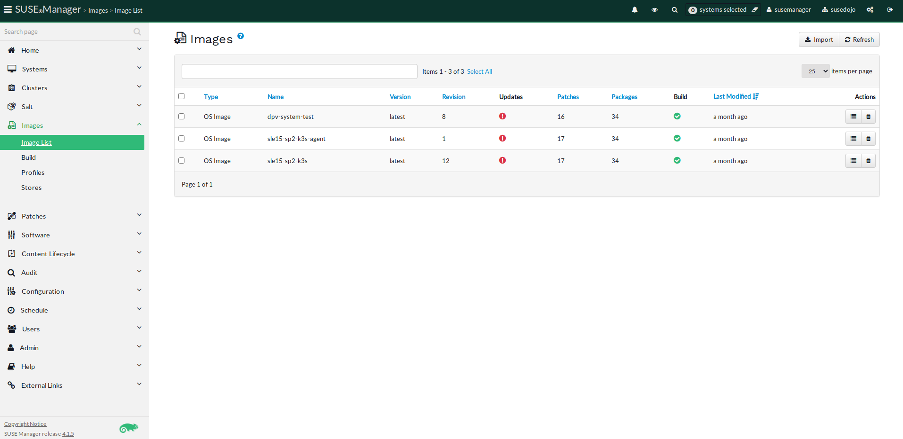

- [SUSE Manager + Rancher + K3s/RKE Automation](#suse-manager--rancher--k3srke-automation)
  - [Setup SUSE Manager Server](#setup-suse-manager-server)
    - [Create Activation keys](#create-activation-keys)
    - [Create a Group](#create-a-group)
  - [Setup OS Image Build Host](#setup-os-image-build-host)
    - [Create OS Image from template](#create-os-image-from-template)
  - [Salt Pillar Creation](#salt-pillar-creation)
  - [Configuration Channels Setup](#configuration-channels-setup)
    - [Master node channels](#master-node-channels)
    - [Worker node Channels](#worker-node-channels)
  - [Salt States](#salt-states)
  - [Image Deployment](#image-deployment)


# SUSE Manager + Rancher + K3s/RKE Automation

Automation of Rancher, K3s, RKE, RKE2 through Salt and SUSE Manager

The goal of the information here is to demonstrate how you can use SUSE Manager to automate the deployment of a SLES 15 SP2+ image and install K3s upon activation against a SUSE Manager Server. Once activated and K3s is installed you can also automate the creation of a Rancher cluster and register the installed K3s node to the Rancher cluster. There are variations of this that will work in different ways and I will call those out in the various sections since you may want to use that variation in another use case. Once you have one K3s node installed and registered to Rancher then you can also add a second k3s node as a worker or another master for your design configuration.
There is great value in the use of this method for deployment and here is a list of those values you can realize when you have this all setup.  
- Activated systems with SUSE Manager get full patch/update lifecycle management.  
- Activated systems with SUSE Manager get full monitoring with Prometheus Exporters (Optional Setup).
- Full Image lifecycle/rebuild with the SLE-Build-Host so new deployments are patched.
- Full audit capabilities from SUSE Manager
- Full configuration management functionality with Salt.  

Requirements for setup and use:   
Follow each section in full to get yourself into a working state.   
- Setup SUSE Manager Server
- Setup SLE Build Host
- Salt Pillar
- Configuration Channels
  - Master node channels
  - Worker node channels  
- Salt States
- Image Deployment
## Setup SUSE Manager Server
The recommendation here is to follow the SUSE Manager documentation for requirements, setup, and deployment.  
Installing SUSE Manager for testing can be done fairly quickly if you have available all of the packages and media downloaded to an RMT (Repository Mirroring Tool) Server. To setup and install an RMT Server and mirror the software repositories you will be using in SUSE Manager you can reference [SLES RMT documentation](https://documentation.suse.com/sles/15-SP2/html/SLES-all/cha-rmt-installation.html).   
For a quick installation and instruction on how to get up and running please reference the [SUSE Manager Documentation](https://documentation.suse.com/external-tree/en-us/suma/4.1/suse-manager/installation/install-server-unified.html).  
The remaining instructions can also be used with Uyuni as well. If you would prefer to test with Uyuni then you can reference the [Uyuni documentation](https://www.uyuni-project.org/uyuni-docs/uyuni/installation/install-overview.html).  
### Create Activation keys
Activation keys are used to ensure that your deployed images have correct software entitlements, software channels, subscribed to any relevant groups, and configuration channels applied. More is explained in the [SUSE Manager Documentation on Activation Keys](https://documentation.suse.com/external-tree/en-us/suma/4.1/suse-manager/client-configuration/activation-keys.html).  
Lets create a few activation keys.  
Navigate to **Systems --> Activation Keys**  
  
In this example we will create two activation keys. The keys will be called k3s and k3s-agent.  
**Click --> + Create Key** in the upper right corner  
Fill in the values (These can be different than the example below)  

>Description: k3s  
>Key: 1-sle15sp2-k3s  
>Usage: leave blank  
>Child Channels: Select all that apply  
>Add-On System Types: Select Monitoring  (This will apply prometheus system exporter if you have a Prometheus monitoring host, otherwise skip)  

**Click --> Create Activation Key**  
Repeat these steps to create k3s-agent activation key and add agent to the Description and Key fields.  

### Create a Group
Use any name you like for the group.  
Follow the [SUSE Manager Documentation to Create a Group](https://documentation.suse.com/external-tree/en-us/suma/4.1/suse-manager/client-configuration/system-groups.html)  
## Setup OS Image Build Host
This is a separate host from the SUSE Manager server that will be used to primarily build OS images.  
Once you have a separate host setup for use and activated to SUSE Manager it can be designated in the properties as an OS Image Build Host.
The configuration and setup of an OS Build Host is best described in the [Image Building Documentation](https://documentation.suse.com/external-tree/en-us/suma/4.1/suse-manager/administration/image-management.html#at.images.kiwi.buildhost). Once you have this setup we are ready to build a few images for our use case.  
### Create OS Image from template
Your image template needs to be sourced from a git repository. SUSE Manager image profiles will source everything from the config.xml to all of the overlay files that go into the image. There are some [SUSE Manager templates](https://github.com/SUSE/manager-build-profiles/tree/master/OSImage) made available publicly in github that can be used as a starting point.  
Also, in this git repository you will see the OSImages folder with a few profile examples as well.  
In order to add your Image Profile to SUSE Manager you need to navigate to **Images --> Profiles**  
  
   
**Click --> +Create** in the upper right  
Fill in the values for each field following the example below.  
>Label: sle15sp2-k3s  
>Image Type: Kiwi  
>Target Image Store: This will default to a web publish location on the SUSE Manager Server  
>Config URL: https://github.com/cseader/manager-rancher-auto/tree/main/OSImage/Image-sle15sp2-JeOS (Location of your config.xml, and overlay files)  
>Activation Key: 1-sle15sp2-k3s (select what you used in the Activation Key creation step)  
>Custom Info Values: leave blank  
  
**Click --> +Create**  
  
Now that we have a profile, Let's build it!  
Navigate to **Images --> Build**  
  
  
Fill in the values for each field by selecting the Image Profile you just created and then selecting your Build Host you have configured.  
**Click --> Build**  
This process should take anywhere from 3-10 minutes depending on the resources of your Build Host.  
Once it is finished you can navigate to **Images --> Image List** in order to view it and manage it. From here your able to rebuild an image at any time to update it with recent patches that are available.  
  

## Salt Pillar Creation  
The pillar data in this repository located in /salt/pillar/ is used to create the K3s pillar data on the SUSE Manager Server so that the salt states will have the right values when they execute.  
In /salt/pillar/ there is a file called top.sls which gives the name of the pillar and the scope of minions that it applies to, which in this case is a wildcard for all minions. In production deployments you would want to narrow this down to a group of minions for your K3s/RKE cluster.
These files needs to be located in /srv/pillar/ on the SUSE Manager server.  
```
  base:  
    '*':  
      - k3s  
```
Under the /salt/pillar/k3s/ you will see init.sls which holds the pillar data.  
You should populate "server" value with your k3s master node. The value for token can be whatever you want it to. You can get fancy with a 128 bit token value for example. Here is something for 32 char if you want a random string for your token. `cat /dev/urandom | tr -dc 'a-zA-Z0-9' | fold -w 32 | head -n 1`
```
k3s:
  server: k3s-1.susedojo.com
  token: K3sdemotokenwithSUMA 
  cni:
  datastore-endpoint:
```
Once you have stored thse files in /srv/pillar on the SUSE Manager Server then you will need to run a few commands to load the pillar data.  
Refresh pillar data on SUSE Manager Server:    
```
salt '*' saltutil.refresh_pillar
```
To print the new k3s pillar data:
```
salt 'k3s-1.susedojo.com' pillar.get k3s
```
To just grab the token you can also run:
```
salt 'k3s-1.susedojo.com' pillar.get k3s:token
```
Notice instead of using a wildcard here for the salt command I'm sending the query to the salt master server in my setup. As I mentioned in a previous step, every server will print this data because the scope in the first top.sls file is for all minions to see this pillar data. You could modify that scope in your environment to the minions that are part of the K3s cluster. You would need to know those systems beforehand.  

## Configuration Channels Setup

### Master node channels

### Worker node Channels

## Salt States

## Image Deployment


